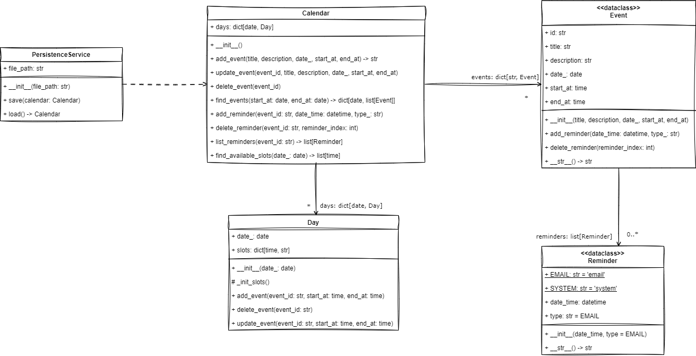

# Ejercicio CalendarApp

Para este ejercicio debes implementar una aplicación de calendario por consola que permita gestionar eventos. 
La aplicación debe permitir las siguientes funcionalidades: 

- Agregar, actualizar y eliminar eventos.
- Ver la lista de todos los eventos programados para un rango de fechas dado.
- Agregar, eliminar y listar recordatorios para un evento.
- Visualizar los espacios disponibles en un rango de fechas dado.

Para implementar la aplicación, debes seguir el siguiente diseño propuesto:



Tu tarea es implementar el diseño que se muestra en la imagen anterior, específicamente las clases `Calendar`, 
`Day`, `Event` y `Reminder` que se deben definir en el módulo `app/model/calendar.py`. Para ello, debes tener en cuenta 
las siguientes instrucciones:

1. **Clase** `Reminder`

   - La clase se debe implementar como una dataclass.
   - Las constantes `EMAIL` y `SYSTEM` se deben implementar como variables de clase con los valores por defecto "email" y 
   "system" respectivamente.
   - El atributo `date_time` debe ser de tipo `datetime` y se inicializa en el constructor de forma obligatoria.
   - El atributo `type` de ser de tipo `str` y se inicializa en el constructor de forma opcional, ya que debe tener como 
   valor por defecto la constante `EMAIL`.
   - El método `__str__` retorna una cadena de texto con el siguiente formato: 
   `"Reminder on {date_time} of type {type}"`.  

2. **Clase** `Event`

   - La clase se debe implementar como una dataclass.
   - Los atributos `title` de tipo `str`, `description` de tipo `str`, `date_` de tipo `date`, `start_at` de tipo 
   `time` y `end_at` de tipo `time` se deben inicializar con parámetros en el constructor de forma obligatoria.
   - El atributo `reminders` de tipo `list[Reminder]` no se inicializa con parámetro en el constructor y debe tener como valor 
   por defecto una lista vacía.
   - El atributo `id` de tipo `str` se inicializa con un parámetro opcional en el constructor, pero debe tener un valor por 
   defecto igual al resultado de invocar la función `generate_unique_id` que se encuentra en el módulo `app.services.util`.
     (Utiliza el parámetro `default_factory` de la función `field` de la librería `dataclasses` para asignar el valor por
        defecto).
   - El método `add_reminder` crea un objeto de la clase `Reminder` con los parámetros recibidos y lo agrega a la lista
   `reminders` del evento.
   - El método `delete_reminder` recibe un parámetro `reminder_index` de tipo `int` que representa un índice de la lista
    `reminders`. En el cuerpo del método verifica si el índice es válido (corresponde a un elemento de la lista) y en 
    caso afirmativo elimina el elemento de la lista `reminders` en la posición indicada por el índice. En caso contrario,
   invoca la función `reminder_not_found_error` que se encuentra en el módulo `app.services.util`.
   - El método `__str__` retorna una cadena de texto con el siguiente formato: 
   ```text
   ID: {id}
   Event title: {title}
   Description: {description}
   Time: {start_at} - {end_at}
    ```

3. **Clase** `Day`

   - La clase **no** se debe implementar como una dataclass, sino como una clase normal.
   - El atributo `date_` de tipo `date` se inicializa con un parámetro en el constructor de forma obligatoria.
   - El atributo `slots` de tipo `dict[time, str | None]` no se inicializa con un parámetro en el constructor. Su 
   valor inicial es un diccionario vacío.
   - Al final del cuerpo del constructor, se debe invocar el método `_init_slots`
   - El método `_init_slots` inicializa el diccionario `slots` con las horas del día (de 00:00 a 23:45 con espacios de 
   15 minutos) como claves y `None` como valores iniciales. 
   
   > Ten en cuenta que los objetos de la clase `time` se crean
   pasando como parámetros la hora y los minutos. Por ejemplo: `time(10, 30)` crea un objeto de la clase `time` que
    representa las 10:30 a.m.

   - El método `add_event` recibe un parámetro `event_id` de tipo `str`, un parámetro `start_at` de tipo `time` y un 
   parámetro `end_at` de tipo `time`. El método debe agregar el `event_id` en todos los slots que estén incluidos
   en el rango de tiempo dado (sin incluir el slot correspondiente a `end_at`). Además, debe verificar que el evento
   no se incluya en slots que ya están ocupados. Si hay alguno de los slot del rango ocupado, el método invoca la función 
    `slot_not_available_error` que se encuentra en el módulo `app.services.util`.
   - Para completar la clase, pega el siguiente código al final de la clase:
   
    ```python
    def delete_event(self, event_id: str):
        deleted = False
        for slot, saved_id in self.slots.items():
            if saved_id == event_id:
                self.slots[slot] = None
                deleted = True
        if not deleted:
            event_not_found_error()

    def update_event(self, event_id: str, start_at: time, end_at: time):
        for slot in self.slots:
            if self.slots[slot] == event_id:
                self.slots[slot] = None

        for slot in self.slots:
            if start_at <= slot < end_at:
                if self.slots[slot]:
                    slot_not_available_error()
                else:
                    self.slots[slot] = event_id
    ```
   
4. **Clase** `Calendar`

   - La clase **no** se debe implementar como una dataclass, sino como una clase normal.
   - El atributo `days` de tipo `dict[date, Day]` no se inicializa con un parámetro en el constructor. Su valor inicial
    es un diccionario vacío.
   - El atributo `events` de tipo `dict[str, Event]` no se inicializa con un parámetro en el constructor. Su valor 
   inicial es un diccionario vacío.
   - El método `add_event` recibe los parámetros `title` de tipo `str`, `description` de tipo `str`, `date_` de tipo
    `date`, `start_at` de tipo `time` y `end_at` de tipo `time`. El método verifica que la fecha `date_` no sea anterior
    a la fecha actual (puede utilizar la función `datetime.now().date()`). En caso de que la fecha sea anterior a la fecha actual, el método invoca la función
    `date_lower_than_today_error` que se encuentra en el módulo `app.services.util`. En caso contrario, 
   el método verifica si no hay un objeto de la clase `Day` en el diccionario `days` con la fecha `date_` como clave.
    En caso de que no exista un objeto de la clase `Day` con la fecha `date_` como clave, el método crea un objeto de la
    clase `Day` con la fecha `date_` y lo agrega al diccionario `days`. Luego, crea un objeto de la clase `Event` con
   los parámetros recibidos e invoca el método `add_event` del objeto de la clase `Day` para agregar el evento. Luego,
   agrega el evento al diccionario `events` con el id del evento como clave. Al final, el método retorna el `id` del 
   evento creado.
   - El método `add_reminder` recibe un parámetro `event_id` de tipo `str`, un parámetro `date_time` de tipo `datetime`
    y un parámetro `type_` de tipo `str`. El método verifica si el evento con el `event_id` existe en el diccionario
    `events`. En caso de que no exista, el método invoca la función `event_not_found_error` que se encuentra en el módulo
    `app.services.util`. En caso contrario, invoca el método `add_reminder` del objeto de la clase `Event` correspondiente
    al `event_id` con los parámetros recibidos.
   - El método `find_available_slots` recibe un parámetro `date_` de tipo `date` y retorna una lista de objetos de tipo
   `time`. Un espacio disponible es un objeto de la clase `time` que no tiene un evento programado.
   
   > Ten en cuenta que los objetos de tipo `date` y `time` se pueden comparar usando los operadores de comparación 
   > (`<`, `<=`, `>`, `>=`, `==`, `!=`).

   - Para completar la clase, pega el siguiente código al final de la clase:
   
    ```python
    def update_event(self, event_id: str, title: str, description: str, date_: date, start_at: time, end_at: time):
        event = self.events[event_id]
        if not event:
            event_not_found_error()

        is_new_date = False

        if event.date_ != date_:
            self.delete_event(event_id)
            event = Event(title=title, description=description, date_=date_, start_at=start_at, end_at=end_at)
            event.id = event_id
            self.events[event_id] = event
            is_new_date = True
            if date_ not in self.days:
                self.days[date_] = Day(date_)
            day = self.days[date_]
            day.add_event(event_id, start_at, end_at)
        else:
            event.title = title
            event.description = description
            event.date_ = date_
            event.start_at = start_at
            event.end_at = end_at

        for day in self.days.values():
            if not is_new_date and event_id in day.slots.values():
                day.delete_event(event.id)
                day.update_event(event.id, start_at, end_at)

    def delete_event(self, event_id: str):
        if event_id not in self.events:
            event_not_found_error()

        self.events.pop(event_id)

        for day in self.days.values():
            if event_id in day.slots.values():
                day.delete_event(event_id)
                break

    def find_events(self, start_at: date, end_at: date) -> dict[date, list[Event]]:
        events: dict[date, list[Event]] = {}
        for event in self.events.values():
            if start_at <= event.date_ <= end_at:
                if event.date_ not in events:
                    events[event.date_] = []
                events[event.date_].append(event)
        return events

    def delete_reminder(self, event_id: str, reminder_index: int):
        event = self.events.get(event_id)
        if not event:
            event_not_found_error()

        event.delete_reminder(reminder_index)
   
    def list_reminders(self, event_id: str) -> list[Reminder]:
        event = self.events.get(event_id)
        if not event:
            event_not_found_error()

        return event.reminders
    ```

## Para tener en cuenta
- El proyecto incluye un conjunto de pruebas que puedes utilizar para verificar el cumplimiento de los requerimientos.
Para ejecutar las pruebas, debes installar la dependencia pytest (`pip install pytest`).
- Para que las pruebas funcionen adecuadamente debes implementar el código respetando 
los nombres y la definición de las clases y los métodos que se presentan en el diagrama.
